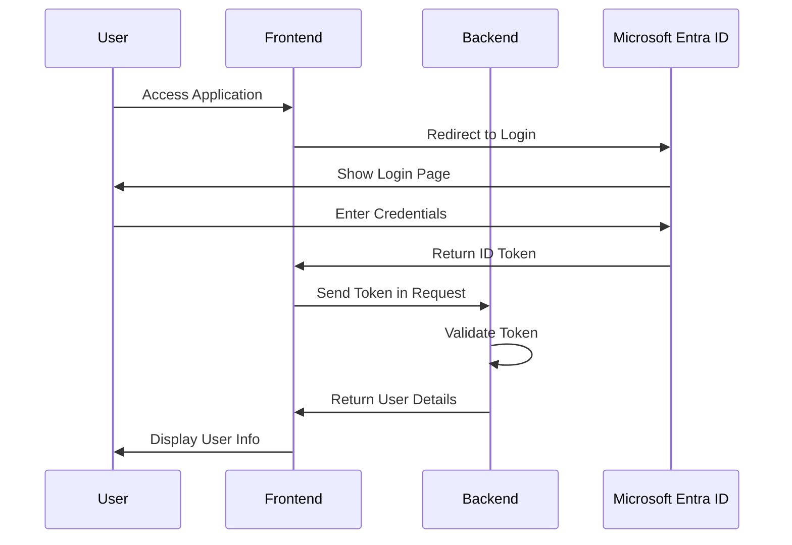

# Authentication Flow Details

## Main Authentication Flow

## Technical Details

### Token Validation Process

1. Frontend receives ID token from Microsoft Entra ID
2. Token is sent to backend in Authorization header
3. Backend validates token signature using Microsoft's public keys
4. Backend verifies token claims (issuer, audience, expiration)
5. If valid, user details are returned to frontend

### Security Considerations

- All tokens are validated server-side
- HTTPS is required for all communications
- Tokens are never stored in localStorage
- Session management is handled securely
- CORS is properly configured 