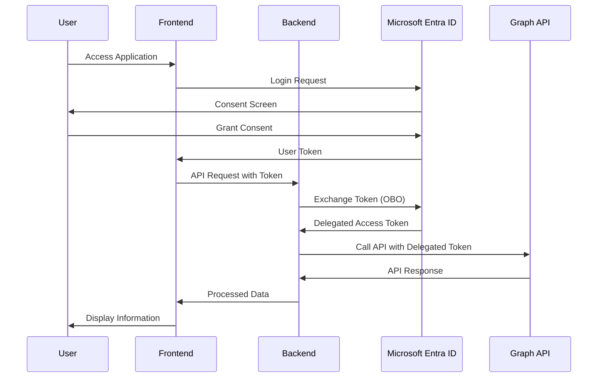

# SharePoint Data Access with Microsoft Graph API and On-Behalf-Of (OBO) Flow

A complete implementation demonstrating secure SharePoint data access using Microsoft Graph API with On-Behalf-Of (OBO) authentication flow. Built with Next.js frontend and Python FastAPI backend for enterprise-grade SharePoint integration.

## Overview

This project demonstrates the implementation of the On-Behalf-Of (OBO) flow, which allows the backend to securely access Microsoft Graph API and other Microsoft services on behalf of the authenticated user.

### New Features - Microsoft Graph API Integration

🎉 **Extended with comprehensive SharePoint and Microsoft Graph API access:**
- **User Profile**: Access detailed user information from Microsoft Graph
- **SharePoint Integration**: Comprehensive SharePoint sites, libraries, lists, and content access
- **Document Management**: Browse and access SharePoint files and documents
- **Advanced SharePoint Features**: Navigation, pages, and recent files access


### Implementation Approach

We use the On-Behalf-Of (OBO) flow because:
- It enables secure access to Microsoft Graph API
- Maintains user context across different Microsoft services
- Supports different scopes for different services
- Follows Microsoft's recommended pattern for service-to-service calls
- Enables long-running operations on behalf of the user

### What We're Achieving

1. **Secure Authentication**
   - User authentication with Microsoft Entra ID
   - Secure token exchange in the backend using OBO flow
   - Protected API endpoints with proper error handling
   - Comprehensive scope management for different services

2. **Comprehensive Microsoft Graph API Access**
   - ✅ User profile information with detailed claims
   - ✅ SharePoint sites and followed sites
   - ✅ SharePoint document libraries with file browsing
   - ✅ SharePoint lists and list items
   - ✅ SharePoint pages and site navigation
   - ✅ Recent SharePoint files access
   - ✅ SharePoint file content retrieval
   - ✅ SharePoint page content access

3. **Modern Architecture**
   - Next.js frontend with MSAL integration
   - Python FastAPI backend with comprehensive error handling
   - Clean separation of concerns
   - Efficient token management and caching
   - Beautiful, responsive UI with Tailwind CSS

### Key Features

- On-Behalf-Of (OBO) flow implementation
- Comprehensive Microsoft Graph API integration
- Next.js with React frontend and tabbed interface
- Python FastAPI backend with robust error handling
- Secure token exchange with retry logic
- Real-time user details display
- Beautiful, responsive UI with Tailwind CSS
- Comprehensive error handling and logging

## API Endpoints

### Authentication Endpoints
- `GET /api/user` - Get basic user details from token claims

### Microsoft Graph API Endpoints
- `GET /api/graph/user` - Get detailed user information from Microsoft Graph
- `GET /api/sharepoint/sites` - Get SharePoint sites and followed sites
- `GET /api/sharepoint/libraries?site_id={id}&search_name={name}` - Get SharePoint document libraries and files
- `GET /api/sharepoint/lists?site_id={id}` - Get SharePoint lists for a specific site
- `GET /api/sharepoint/pages?site_id={id}` - Get SharePoint pages for a specific site
- `GET /api/sharepoint/navigation?site_id={id}` - Get SharePoint site navigation
- `GET /api/sharepoint/recent` - Get user's recent SharePoint files
- `GET /api/sharepoint/file-content?file_id={id}&site_id={id}` - Get SharePoint file content
- `GET /api/sharepoint/page-content?page_id={id}&site_id={id}` - Get SharePoint page content
- `GET /api/debug/token` - Debug endpoint for token information

### Required Permissions

Each API endpoint requires specific Microsoft Graph permissions:

| Endpoint | Required Scope | Description |
|----------|----------------|-------------|
| `/api/graph/user` | `User.Read` | Read user profile |
| `/api/sharepoint/sites` | `Sites.Read.All` | Read SharePoint sites |
| `/api/sharepoint/libraries` | `Sites.Read.All` | Read SharePoint document libraries |
| `/api/sharepoint/lists` | `Sites.Read.All` | Read SharePoint lists |
| `/api/sharepoint/pages` | `Sites.Read.All` | Read SharePoint pages |
| `/api/sharepoint/navigation` | `Sites.Read.All` | Read SharePoint navigation |
| `/api/sharepoint/recent` | `Sites.Read.All` | Read recent SharePoint files |
| `/api/sharepoint/file-content` | `Sites.Read.All` | Read SharePoint file content |
| `/api/sharepoint/page-content` | `Sites.Read.All` | Read SharePoint page content |

## Authentication Flow



## Prerequisites

- Node.js (v18 or higher)
- Python (v3.8 or higher)
- Azure subscription with Microsoft Entra ID access
- Application Administrator or Global Administrator role

## Setup Instructions

### 1. Azure App Registration

**🚨 IMPORTANT**: For OBO flow to work, your app registration must expose an API scope. See our detailed setup checklist: [SETUP_CHECKLIST.md](./SETUP_CHECKLIST.md)

1. Go to [Azure Portal](https://portal.azure.com)
2. Navigate to Microsoft Entra ID → App registrations → New registration
3. Configure:
   - Name: OBO Flow Demo
   - Account types: Single tenant (or multi-tenant if needed)
   - Redirect URI: http://localhost:3000 (SPA)

4. **Expose an API** (Critical for OBO):
   - Set Application ID URI: `api://{your-client-id}`
   - Add scope: `access_as_user`
   - Enable the scope

5. **Add API Permissions** (Microsoft Graph):
   - `User.Read` (Delegated) - Read user profile
   - `Sites.Read.All` (Delegated) - Read SharePoint sites
   - `{your-app}/access_as_user` (Delegated) - Access your API

6. **Create Client Secret**:
   - Go to "Certificates & secrets" → New client secret
   - Copy the secret value (you won't see it again)

7. **Configure Authentication**:
   - Platform configurations → Single-page application
   - Redirect URI: `http://localhost:3000`
   - Enable Access tokens and ID tokens

8. **Grant Admin Consent** (if required):
   - Click "Grant admin consent for [your organization]"
   - This step may require Global Administrator privileges

9. Save the following values:
   - Application (client) ID
   - Directory (tenant) ID
   - Client secret value

### 2. Backend Setup

1. Navigate to backend directory:
   ```bash
   cd backend
   ```

2. Create and activate virtual environment:
   ```bash
   # Windows
   python -m venv venv
   .\venv\Scripts\activate

   # Linux/Mac
   python -m venv venv
   source venv/bin/activate
   ```

3. Install dependencies:
   ```bash
   pip install -r requirements.txt
   ```

4. Create `.env` file:
   ```env
   AZURE_CLIENT_ID=your_client_id_here
   AZURE_TENANT_ID=your_tenant_id_here
   AUTHORITY=https://login.microsoftonline.com/your_tenant_id_here
   AZURE_CLIENT_SECRET=your_client_secret_here
   PORT=5000
   HOST=0.0.0.0
   ALLOWED_ORIGINS=http://localhost:3000
   ```

### 3. Frontend Setup

1. Navigate to frontend directory:
   ```bash
   cd frontend
   ```

2. Install dependencies:
   ```bash
   npm install
   ```

3. Create `.env.local` file:
   ```env
   NEXT_PUBLIC_AZURE_CLIENT_ID=your_client_id_here
   NEXT_PUBLIC_AZURE_TENANT_ID=your_tenant_id_here
   NEXT_PUBLIC_REDIRECT_URI=http://localhost:3000
   NEXT_PUBLIC_API_URL=http://localhost:5000
   ```

## Running the Application

### 1. Start Backend Server

```bash
cd backend
python main.py
```

The backend server will start at http://localhost:5000

### 2. Start Frontend Development Server

```bash
cd frontend
npm run dev
```

The frontend application will be available at http://localhost:3000

### 3. Testing the Application

1. Open http://localhost:3000 in your browser
2. Click "Sign In with Microsoft"
3. Complete the authentication process
4. View your user details and Microsoft Graph API data

## Project Structure

```
OBO-Flow-Demo/
├── frontend/                    # Next.js React Application
│   ├── src/
│   │   ├── app/                # Main application code
│   │   ├── components/         # React components
│   │   └── config/            # Configuration files
│   └── .env.local             # Frontend environment variables
├── backend/                    # Python FastAPI Application
│   ├── main.py                # FastAPI server
│   ├── requirements.txt       # Python dependencies
│   └── .env                  # Backend environment variables
└── README.md                 # This file
```

## Troubleshooting

### Authentication Issues

#### AADSTS65001: Consent Required Error
If you see the error "The user or administrator has not consented to use the application", follow these steps:

1. **Check App Registration Permissions**:
   - Go to Azure Portal > App registrations > Your App > API permissions
   - Ensure all required Microsoft Graph permissions are added
   - Grant admin consent for the organization

2. **Required Permissions**:
   ```
   Microsoft Graph (Delegated):
   - User.Read (Sign in and read user profile)
   - Sites.Read.All (Read SharePoint sites) - Requires admin consent
   [Your App] (Delegated):
   - access_as_user (Access application as user)
   ```

3. **Grant Admin Consent**:
   - In API permissions, click "Grant admin consent for [Organization]"
   - All permissions should show green checkmarks when granted

4. **For detailed setup instructions, see**: [SETUP_CHECKLIST.md](./SETUP_CHECKLIST.md)

#### AADSTS50013: Signature Validation Failed (OBO Flow)
This error occurs when the OBO token exchange fails:

1. **Check API Exposure**:
   - Ensure your app exposes an API with scope `access_as_user`
   - Application ID URI should be `api://{your-client-id}`

2. **Verify Token Audience**:
   - Frontend should request `api://{client-id}/access_as_user` scope
   - Backend should validate token audience matches your application

3. **Check Environment Variables**:
   - Ensure CLIENT_ID matches your Azure app registration
   - Verify AZURE_CLIENT_SECRET is correct and not expired

#### Token Acquisition Errors
- Clear browser cache and cookies
- Sign out completely and sign back in
- Check that environment variables match your Azure app registration

#### Network/CORS Issues
- Ensure backend is running on the correct port (5000)
- Verify CORS settings in backend allow frontend origin
- Check firewall settings if running on different machines

### API Issues
- **403 Forbidden**: Check that the required permissions are granted in Azure
- **404 Not Found**: Verify the API endpoints are correct
- **500 Internal Server Error**: Check the backend logs for detailed error messages

### Common Solutions
1. **Restart Both Services**: Stop and restart both frontend and backend
2. **Clear Browser Data**: Clear cache, cookies, and local storage
3. **Check Environment Variables**: Verify all environment variables are correctly set
4. **Review Azure Configuration**: Double-check client ID, tenant ID, and permissions

## License

MIT License - See [LICENSE](LICENSE) file for details.

---

For detailed documentation, advanced configuration, and troubleshooting, see [readme-complete.md](readme-complete.md).